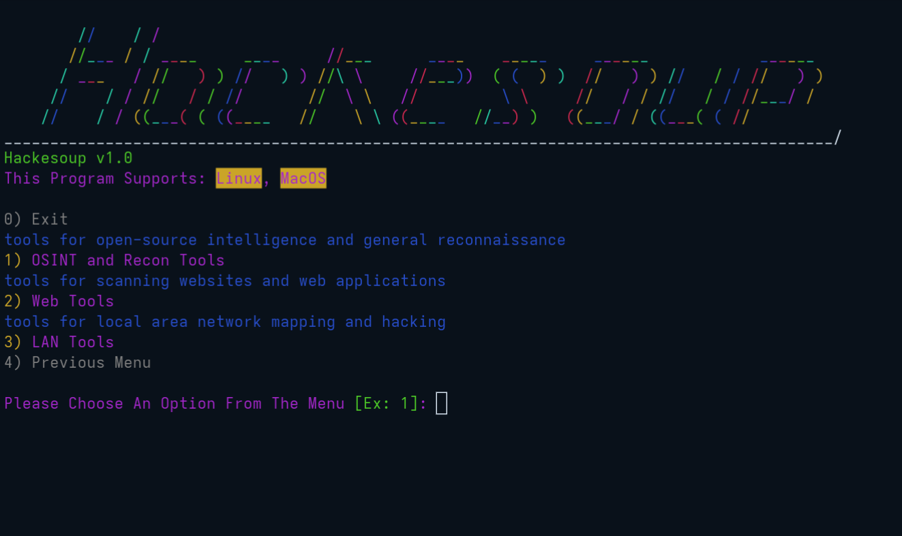

# 🥣 Hackesoup – Hacking Suite for Penetration Testers and Bug Bounty Hunters

[](https://github.com/Gratonic/Hackesoup/blob/main/CONTRIBUTING.md)
[](https://github.com/Gratonic/Hackesoup/blob/main/LICENSE)


> 🧡 **Note:** Hackesoup is a **100% volunteer-driven open source community focused project**.  
> There is **no funding or salaries** involved. Everyone contributes out of passion for learning and helping others.

## Hackesoup is an all-in-one hacking suite built for Penetration Testing and Bug Bounty Hunting.


## ✨ Vision

In today’s cybersecurity landscape, professionals face significant challenges, including an overwhelming number of complex tools, high costs associated with closed-source tools, and a lack of free and open-source options. These barriers can be a headache for cybersecurity professionals. Hackesoup was created to tackle these issues by providing a diverse range of free and open-source hacking tools designed specifically for penetration testing and bug bounty hunting, all integrated into a single hacking suite. Together, we can revolutionize the cybersecurity landscape with hard work fueled by passion.



---

## 🔧 How To Install Hackesoup

0) sudo dnf install python3.12 or sudo apt install python3.12 (install python version 3.12)

1) cd path/to/Hackesoup                  (project root directory)
2) chmod 700 ./Config/Linux/install.sh   (gives you permission to read, write, and execute the install file - might need sudo)
3) ./Config/Linux/install.sh             (runs the install file, which creates a virtual environment and installs the requirements)
4) source ./hackesoup_venv/bin/activate  (starts the virtual environment created by the install script)
5) cd Interfaces                         (moves to the Interfaces/ directory)
6) python3 hsmi.py                       (runs the programs menu interface - the other interfaces are unavailable)

NOTE:
    * You'll have to complete step 4 every time you run Hackesoup (the venv is located in Hackesoup [the project root directory])
    * To deactivate the virtual environment (venv), run the command "deactivate"

## 🚀 Features (Planned)

- Clean and organized UI
- Fast and user-friendly toolset
- Support for multiple languages

## 🛠️ Tools (Complete: ✅, Planned: *)

✅ PatchPirate   (GitHub OSINT tool)

✅ Serikandor    (website OSINT and mapper tool)

✅ Wafter        (WAF detector)

✅ Mudelatie     (XSS vulnerability scanner)
-  Dabijar       (SQLI vulnerability scanner)
-  Baumspinne    (directory traversal vulnerability scanner)
-  Soupemapper   (network mapper)

---

## 🏗️ Project Status: `🚧 In Development`

We are in the early phase of development. Currently working on:

- 👨‍💻 Gathering contributors
- 📝 Writing documentation
- 🛠️ Writing and improving tools


---

## 🧑‍🤝‍🧑 Join the Team

We welcome **everyone** – beginner or expert!

### 👥 Roles Needed:

| Role                            | Description                          |
| --------------------------------| -------------------------------------|
| 👨‍💻 Programmers/Developers       | Python, C/C++, Bash                  |
| 🔒️ Cybersecurity Professionals  | Blue, Red, and Purple Teamers        |
| 🎨 UI/UX Designers              | Help shape the look and feel         |
| 🐞 Bug Testers                  | Find and report issues               |
| 🐞 Bug Fixers                   | Fix bugs                             |

💬 [Chat with us on Discord](https://discord.gg/Kk6MqzH7ec)

---

## 🛠️ Code Stack

| Layer      | Language                             |
| ---------- | -------------------------------------|
| UI         | Python                               |
| Tools      | Python, C/C++, Bash                  |

---

## File Tree
```bash
Hackesoup # project root directory
├── Config # configuration files
│   └── Linux
│       └── install.sh
├── Images
│   └── hackesoup.png
├── Interfaces # UI files
│   ├── hscli.py
│   ├── hsgui.py
│   └── hsmi.py
├── Soup # core functionality files
│   ├── DB # data for tools
│   │   ├── Mudelatie
│   │   │   └── payloads.txt
│   │   └── Wafter
│   │       └── waf_signatures.json
│   ├── Lib # libraries, modules, data
│   │   ├── Data # data files (JSON, TXT, etc.)
│   │   │   ├── Input_Data # user input file
│   │   │   │   └── input.json # (populated by menu interface)
│   │   │   └──  Output_Data # tool output file
│   │   │       └── output.json # (populated by tool)
│   │   └── Python_Modules
│   │       ├── crawler.py
│   │       ├── menataur.py
│   │       ├── menu_data.py
│   │       ├── menu_interface.py
│   │       ├── prompts.py
│   │       ├── utils.py
│   │       └── validator.py
│   └── Tools
│       ├── baumspinne.py # Directory Traversal Scanner
│       ├── dabijar.py # SQLI Scanner
│       ├── mudelatie.py # XSS Scanner
│       ├── patchpirate.py # GitHub OSINT Tool
│       ├── serikandor.py # Subdomain Finder
│       ├── soupemapper.py # Network Mapper
│       └── wafter.py # WAF Detector
├── CONTRIBUTING.md
├── LICENSE.md
├── README.md
└── requirements.txt
```

---

## 📌 Progress and Development Plan

- [X] Write a menu interface
- [ ] Write and improve tools
- [ ] Add multi-langauge support
- [ ] Write installation file (with language selection menu)
- [ ] Write a GUI
- [ ] Write documentation

---

## 🤝 How to Contribute

1. Join the [discord server](https://discord.gg/Kk6MqzH7ec)
2. Create a fork
3. Clone the repository to your machine and request an [issue](https://github.com/Gratonic/Hackesoup/issues)
4. Push your changes to your fork
5. Create a pull request to the [main repository](https://github.com/Gratonic/Hackesoup/pulls) with your changes
6. We’ll review it together!

---

## 📜 License

MIT License – free to use, modify, and share.

---

## 👤 Hackesoup Leaders

- [**Gratonic**](https://github.com/Gratonic) – Project Founder and Developer,
- [**FailurePoint**](https://github.com/FailurePoint) – Co-Founder and Developer,
> with ❤️ from the open-source community.

---

## 🌍 Let’s Revolutionize The Cybersecurity Landscape Together

💥 Drop a “I'm ready to join the Revolution!” in the [Discussions](https://github.com/Gratonic/Hackesoup/discussions) on GitHub <br>
📬 Or drop it in the general chat in the [Hackesoup discord server](https://discord.gg/Kk6MqzH7ec)

> 🌱 Hackesoup is for everyone with an ethical mindset and a passion for computers